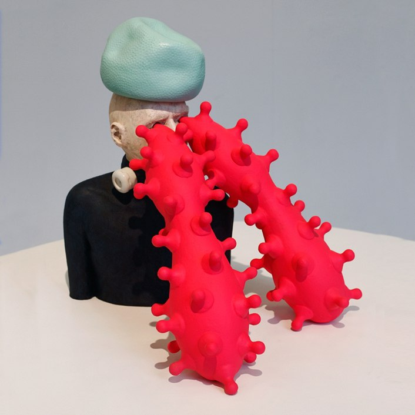
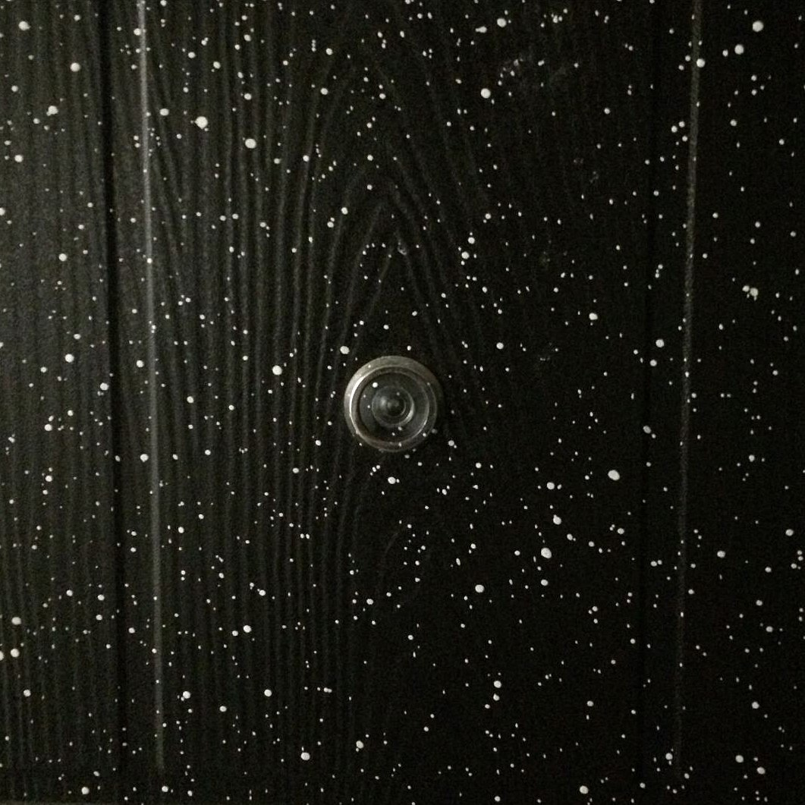
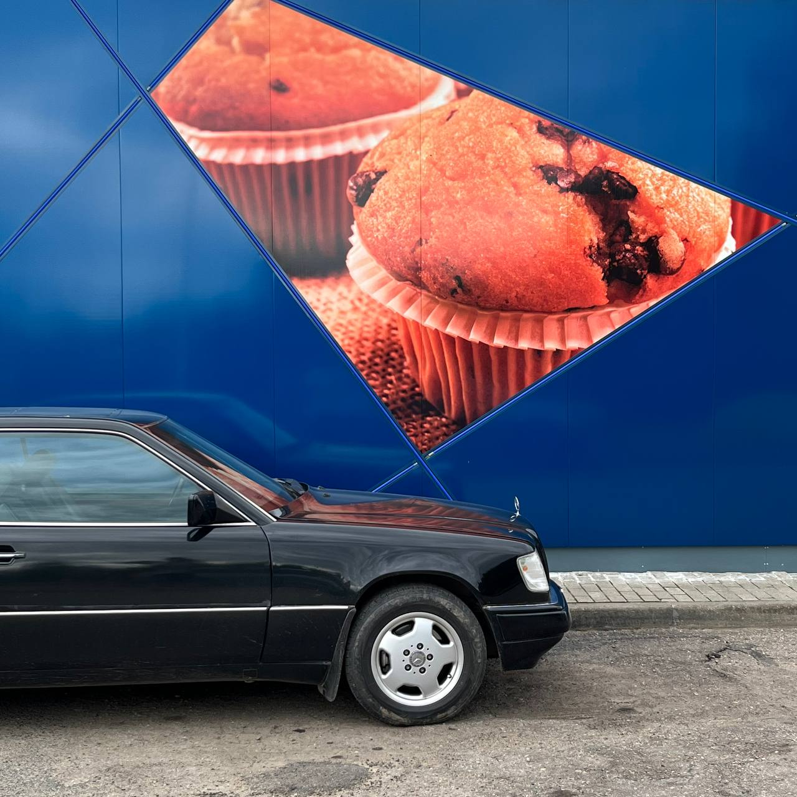
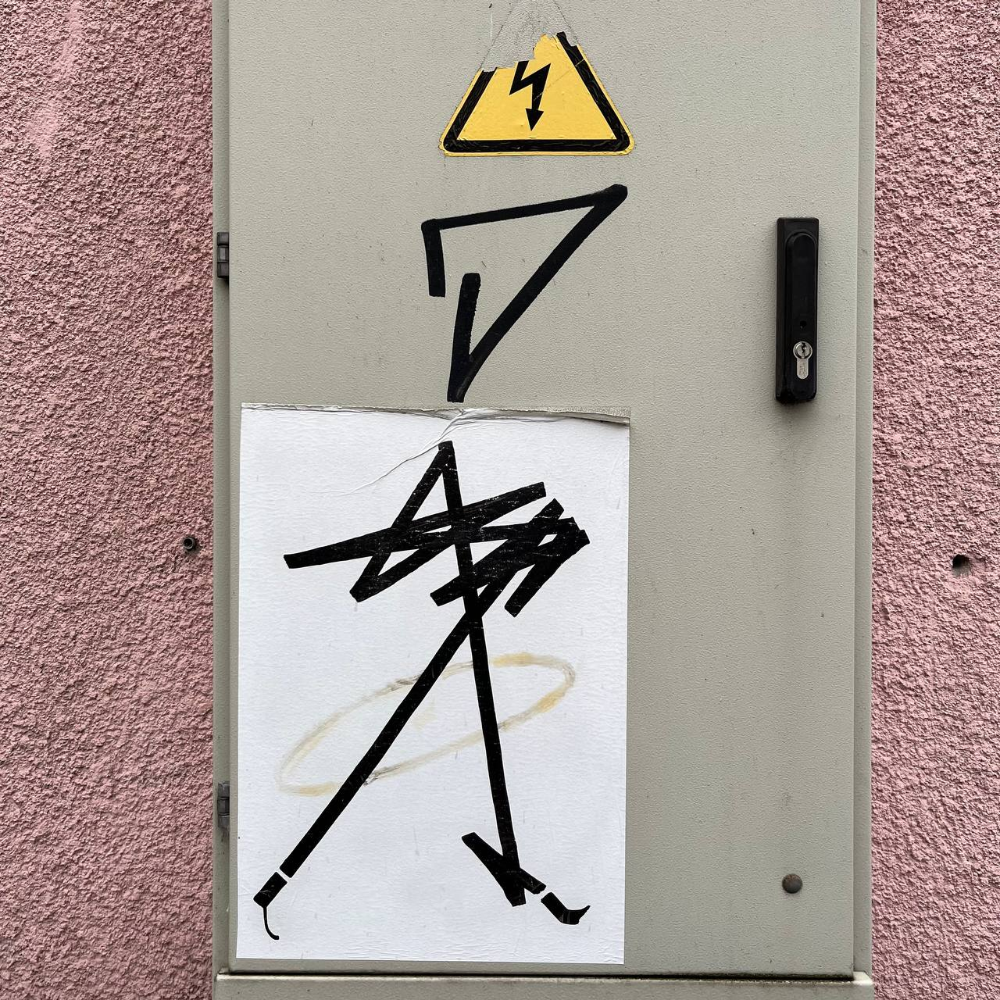
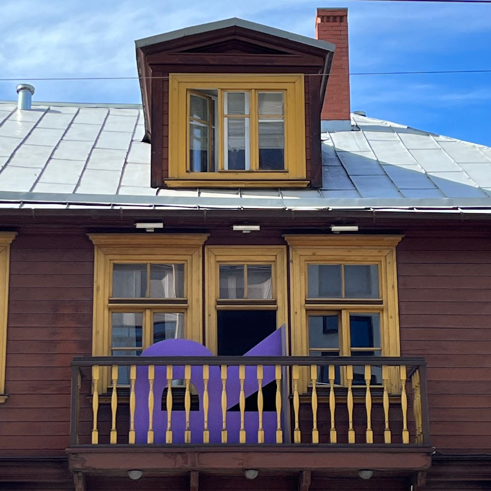
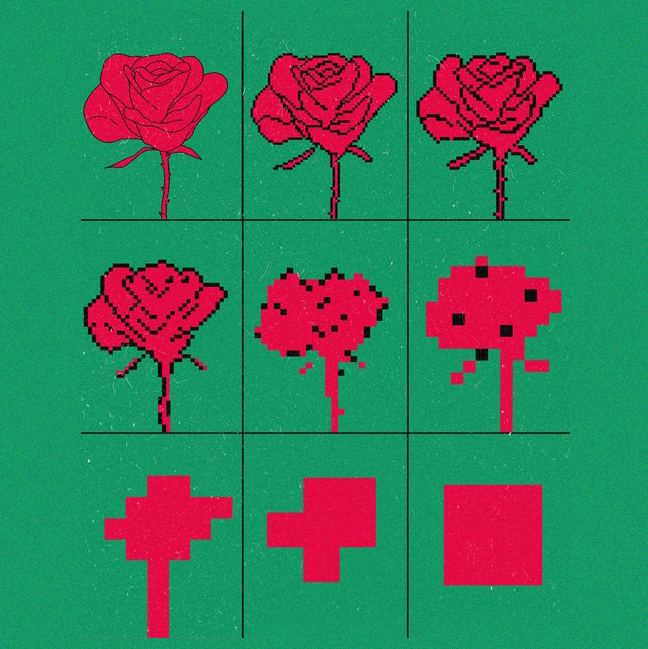
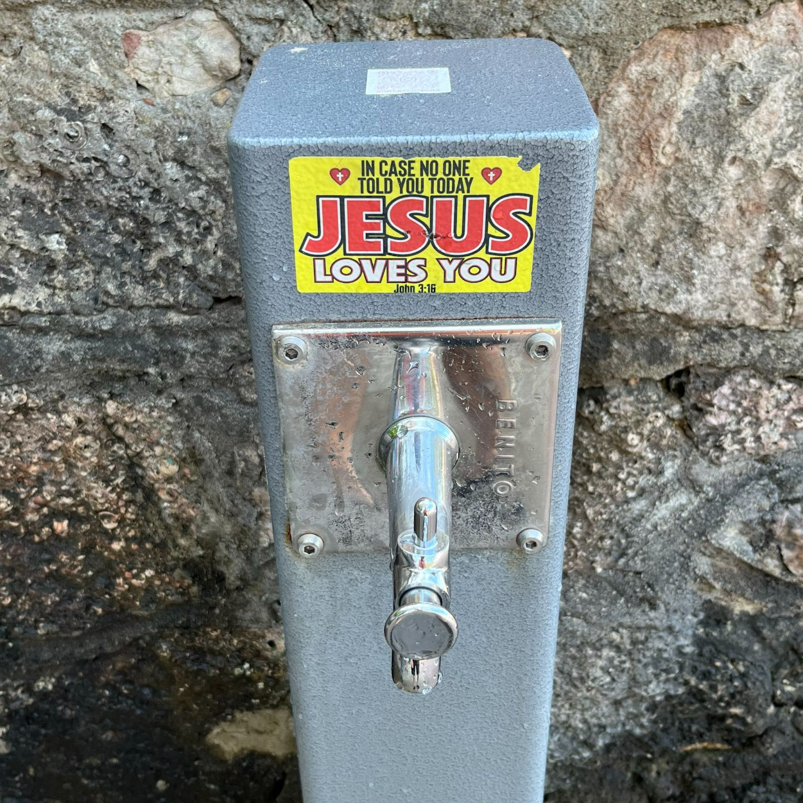
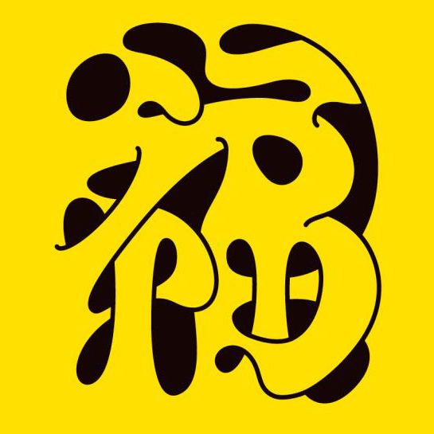

# designworkout
Design workout exercises for https://online.designworkout.ru/.

## exercises

| Exercise | What is it about | Type |
| ---- | ----- | ---------- |
| [exercise1](./exercise1/readme.md) |  Проанализируйте образ героя и достройте его погрудный портрет до полноростового. | `interpretation` |
| [exercise2](./exercise2/readme.md) |  Как бы то ни было, в результате Большого взрыва появились не только миллиарды звёзд и планет но ещё и ряд объектов, один из которых на примере. Предложите варианты остальных. | `interpretation` |
| [exercise3](./exercise3/readme.md) |  Изучите образы Mercedes-Benz W124 Е300 купе и маффина с черникой. Предложите фазы трансформации одного объекта в другой, последовательно меняя один параметр каждого объекта. | `system` |
| [exercise4](./exercise4/readme.md) |  Внешний вид героя сильно изменился благодаря воздействию электричества. Проанализируйте формы и предложите исходный образ героя и варианты его трансформации под воздействием воды, огня и сильного ветра. | `interpretation` |
| [exercise5](./exercise5/readme.md) |  Это [здание](https://g.page/Raugs) используется как словарь архитектурных терминов. Найдите название каждого использованного архитектурного элемента на английском. В характере заглавной буквы выразите образ каждого объекта. На примере балясины балкона — Rail posts. | `typography` |
| [exercise6](./exercise6/readme.md) |  Используя предложенный метод формализуйте изображения фронтального погрузчика Linde, удода, соковыжималки для граната Cancan и Эдди Ван Халена на сцене с гитарой в прыжке. | `formalisation` |
| [exercise7](./exercise7/readme.md) |  Предложите для объектов городской инфраструктуры другие варианты стикеров, которые послужат оздоровлению психологического климата горожан. | `communication` |
| [exercise8](./exercise8/readme.md) |  Найдите персонажей, мимикрирующих под бактериальную флору и дорисуйте их ростовые портреты. | `silhouette` |
