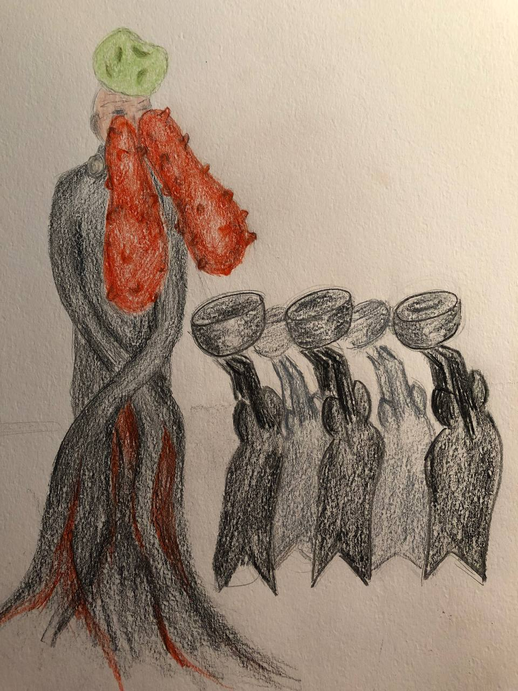

# Exercise 1

`interpretation` 

time spent - 3 hours

Проанализируйте образ героя и достройте его погрудный портрет до полноростового.

## Working

### References
- [СЕМАНТИКА ФРАЗЕОЛОГИЗМОВ С КОМПОНЕНТОМ КРОВЬ – SANGUE В РУССКОМ И ИТАЛЬЯНСКОМ ЯЗЫКАХ](https://elib.bsu.by/bitstream/123456789/217733/1/310-317.pdf)
- [THE OCULAR SURFACE / JULY 2011, VOL. 9, NO. 3 / www.theocularsurface.com 117 Bloody Tears: Historical Review and Report of a New Case](https://coek.info/pdf-bloody-tears-historical-review-and-report-of-a-new-case-.html)

### Research and dev

В русском тождественные фразеологизмы связаны с **эмоциями**. Они могут
означать эмоциональный всплеск, вызванный **возмущением**,
**негодованием**, **стыдом** и другими внезапными негативными эмоциями
или быть связанными с сильными неожиданными чувственными
потрясениями, **утратой самообладания и эмоционального равновесия**:
кровь кинулась в лицо; глаза налились кровью; кровь бросилась в голову.

В этих выражениях кровь наделяется способностью производить **самостоятельное действие**, выраженное в
умении подниматься, совершать резкое движение вверх, связанное с общим эмоциональным состоянием человека.

В группу фразеологизмов со значением **казнит**ь или **быть казненным**, **убивать** входят следующие: купаться в крови; напиться крови;
обагрять руки кровью; утопить в крови; лить реки крови – bagnarsi le
mani di sangue (умывать руки кровью); pagarla con il sangue (платить
кровью); frustare a sangue в значении «пороть, бичевать, критиковать».
Во фразеологизмах этой группы актуализированы семы **«цинизм»**,
«обилие», «дикость», «жестокость». Месть, **расплата за нанесенную обиду** или ущерб отражена во фразеологизме: кровь за кровь. 
Фразеологизм подобен библейским выражениям: око за око, зуб за зуб; душу за
душу, руку за руку, ногу за ногу (Исх. 21, Втор. 19, 21, МФ, 5, 38), в него
включается сема «равноценность». В «Словаре русского сленга» В.С.
Елистратова фразеологизмы с компонентом кровь в прямом лексическом значении 
связаны с **нанесением телесных повреждений**, а в семантическом значении – с понятием **наказания**, **расплаты**, поражения с
тяжкими телесными повреждениями в драке или кулачном бою: кровью пИсать; пустить кровь из ушей; пустить кровь носом; пусть идет
кровь из носу.

- self-punishment
- religious emotion of compunction (a feeling of guilt or moral scruple that prevents or follows the doing of something bad)

Because either blood or tears can be associated with **peril**, the infrequent occurrence of bloody tears
evokes interest and has sometimes been mentioned in old narrative writings. As Sophocles wrote in 430 BC,
when King Oedipus discovered that he had unknowingly killed his father and married his mother, he, in guilt
and misery, **gouged out his own eyes, which poured blood**.

Since you have chosen to insult my blindness—
you have your eyesight, and you do not see
how miserable you are, or where you live,
or who it is who shares your household.
Do you know the family you come from?
Without your knowledge you’ve become
the enemy of your own kindred 

When, during the Fourth Crusade, the Roman Christians conquered and
sacked the Orthodox Christian Constantinople (1204), the exhausted crusaders “had an **aspect similar to that of dead men**. 
Their eyes were bloodshot for **they shed more blood than tears.**” The reason could be malnutrition, physical
exhaustion, and/or epidemic infection.

### Result

A man as a tree bleading with his tears as a symbol of compunction and self-punishment.

