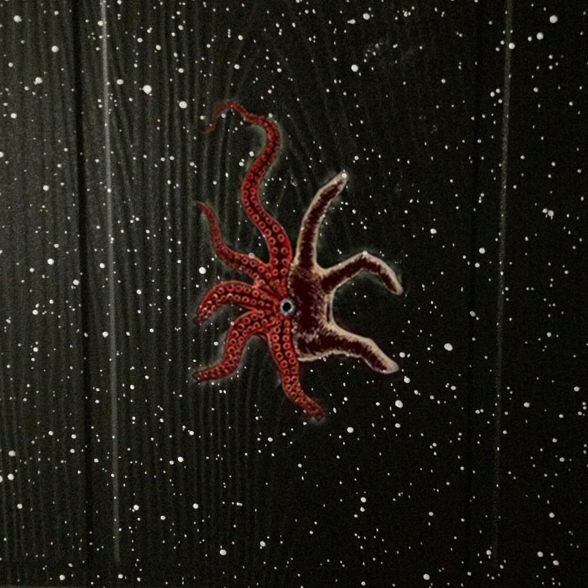
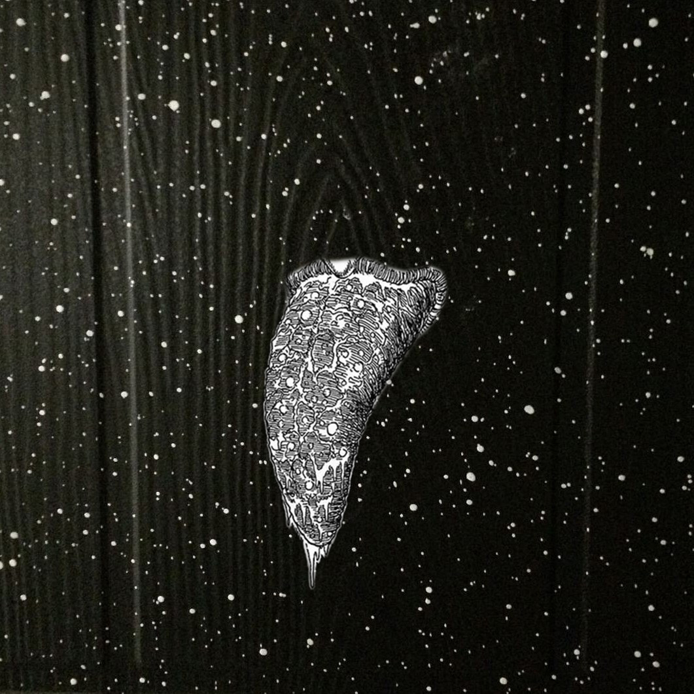
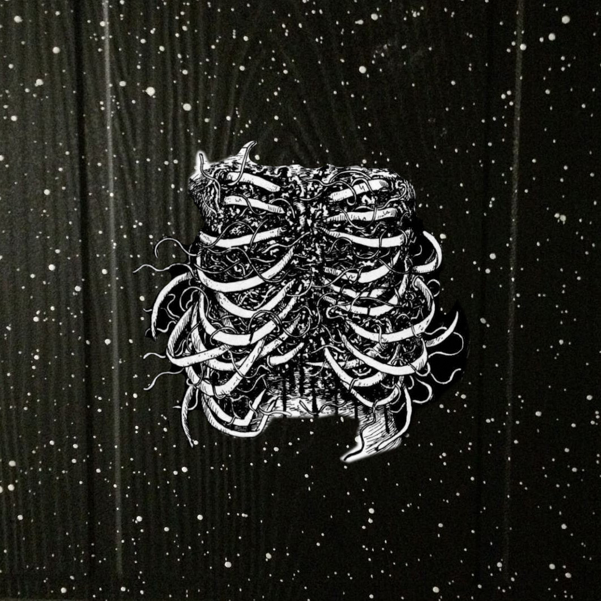

# Exercise 2

`interpretation` 

Как бы то ни было, в результате Большого взрыва появились не только миллиарды звёзд и планет но ещё и ряд объектов, один из которых на примере. Предложите варианты остальных.

## Working

First association was with Junji Ito works. 
After that spent more time trying to find more reasonable and constructive interpretations, like locks and holes in walls, but then still ended up thinking about Lovecraft "cosmic horror".

Not sure how deep should I go though, Cosmicism could be something to explore as well I think.

Here are some links:

- [Lovecraftian horror, sometimes used interchangeably with "cosmic horror"](https://en.wikipedia.org/wiki/Lovecraftian_horror)

### Results

Added some primitive creatures with an idea they can form lovecraftian monsters in future :).

Result 1

Result 2

Result 3

