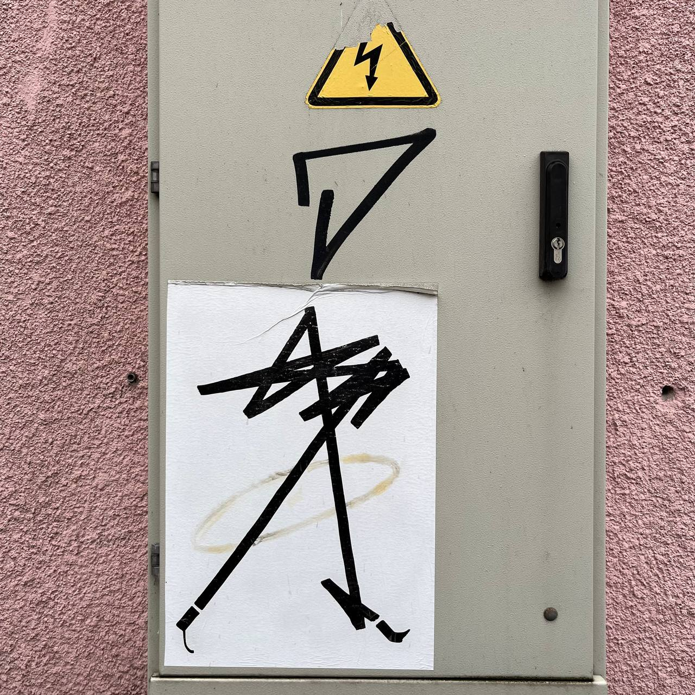

# Exercise 4

`interpretation`

Внешний вид героя сильно изменился благодаря воздействию электричества. Проанализируйте формы и предложите исходный образ героя и варианты его трансформации под воздействием воды, огня и сильного ветра.

## Working