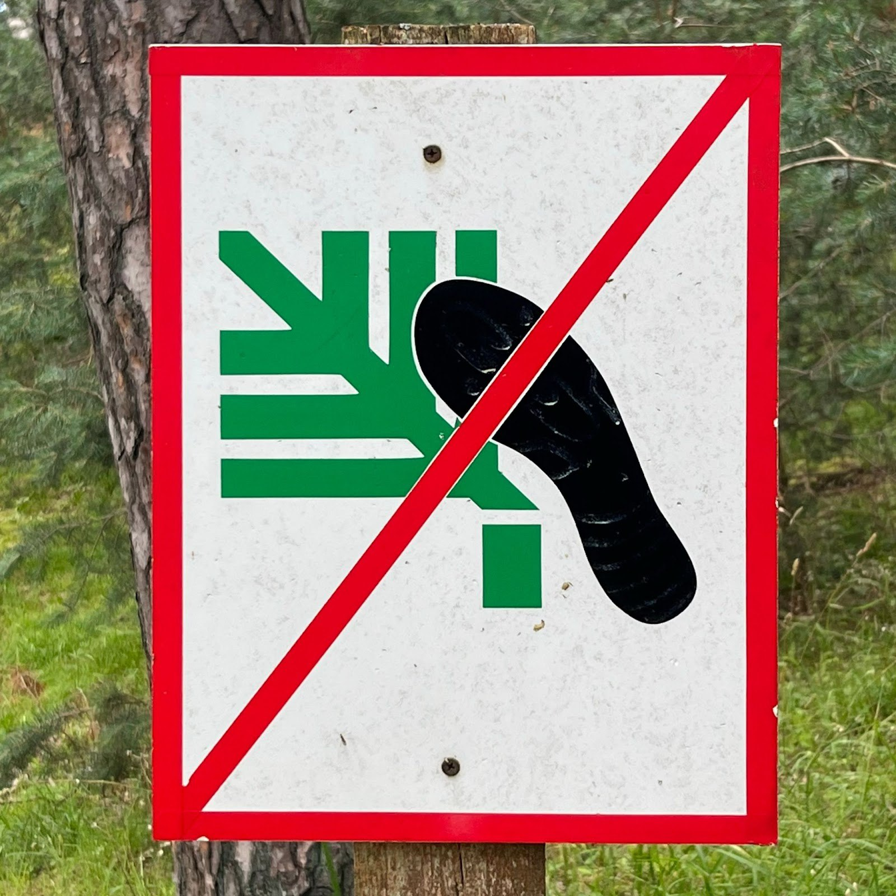
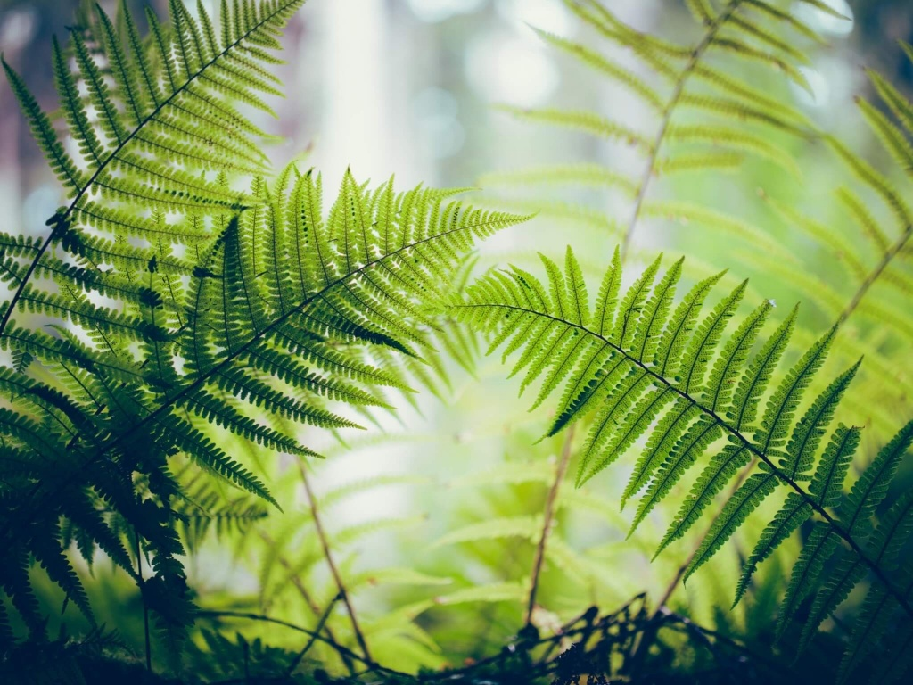
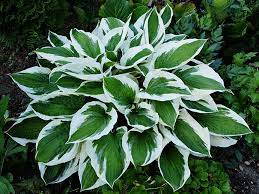
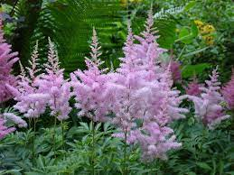
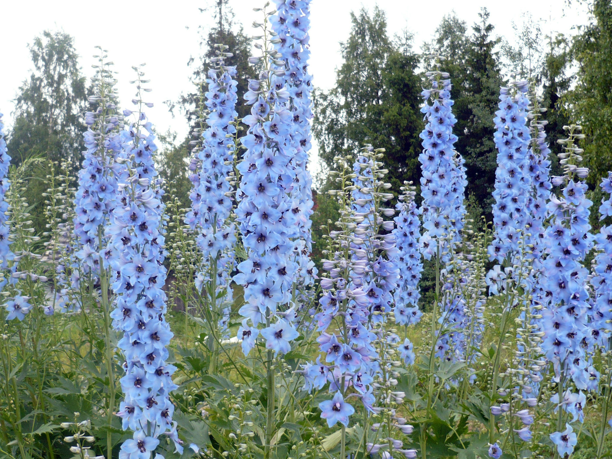
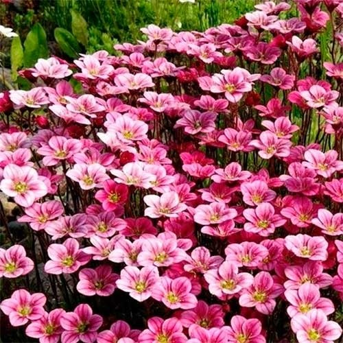

# Exercise 9

`formalisation`

Кроме папоротника на газоне растут другие растения, которые нельзя топтать. Предложите варианты формализации образов: хосты, астильбы, дельфиниума и камнеломки.

## Working

| Растение | Фото | Иллюстрация |
| ----- | ----- | ----- |
| Папоротник |  |  |
| Хоста |  |  |
| Астильба |  |  |
| Дельфиниум |  |  |
| Камнеломка |  |  |